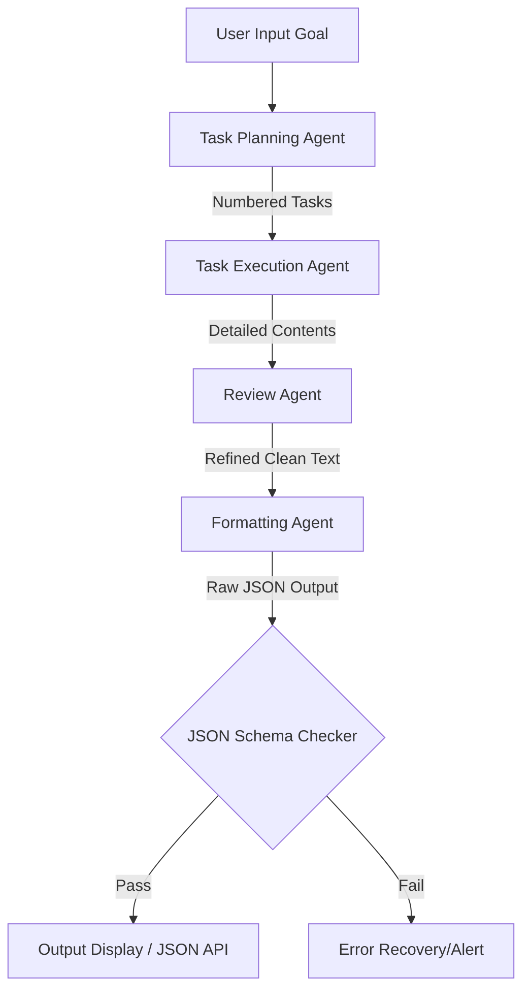
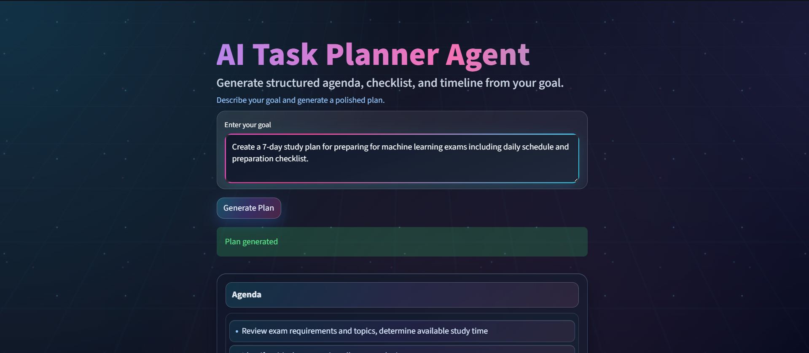
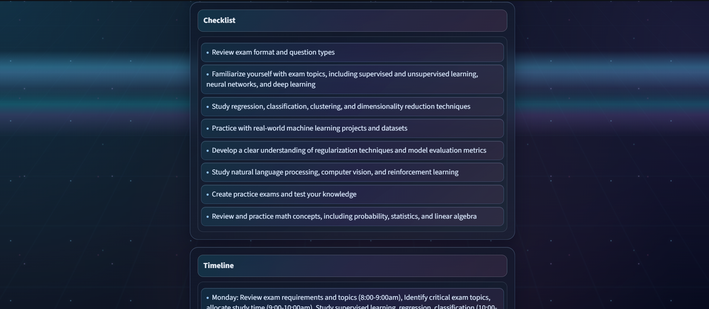

# 🤖 AI Task Planner Agent

[](https://ai-task-planning-agent.streamlit.app/)
[](LICENSE)
[](https://www.python.org/)
[](https://github.com/crewAIInc/crewAI)

A powerful multi-agent planning assistant that converts a high-level goal into a highly structured, validated execution plan. Built on **CrewAI** and **Streamlit**, it runs a sequential multi-agent workflow to produce a clean, production-ready plan containing three core outputs: an **Agenda**, a **Checklist**, and a **Timeline**.

The application offers both a sleek, interactive terminal CLI and a futuristic, glassmorphic Streamlit web interface complete with animated backgrounds, particle drift, and responsive UI elements.

---

## 🔗 Live Demo

Experience the agent in your browser: **[https://ai-task-planning-agent.streamlit.app/](https://ai-task-planning-agent.streamlit.app/)**

---

## 🌟 Key Features

* **Multi-Agent Orchestration**: Powered by **CrewAI** to delegate planning, content generation, review, and formatting to specialized LLM-driven agents.
* **Futuristic Streamlit Web Interface**: A premium dark-mode dashboard with:
  * Glassmorphism-inspired components.
  * Real-time interactive typing animations.
  * Ambient background glows, grid overlays, and drifting particle effects.
  * Accessibility support (`prefers-reduced-motion` media queries).
* **CLI Terminal Interface**: Simple, interactive command-line interface for terminal-first developers.
* **Strict Schema Validation**: Automatic post-processing and schema validation verifying that LLM outputs conform exactly to:
  ```json
  {
    "agenda": ["string", "string"],
    "checklist": ["Category: item", "Category: item"],
    "timeline": ["Period: action", "Period: action"]
  }
  ```
* **Robust Error Handling**: Standardized recovery mechanisms for parsing failures, LLM hallucination containment, and rate limit/cooldown enforcement.

---

## 📐 Architecture & Workflow

The planner implements a linear workflow where each agent builds on the previous agent's output.



### Multi-Agent Crew Details

| Agent | Role | Goal | Backstory |
| :--- | :--- | :--- | :--- |
| **Task Planning Agent** | Planner | Break a high-level goal into clear, actionable, high-level steps. | Expert planner who decomposes broad goals into logical, numbered steps without extra fluff. |
| **Task Execution Agent** | Executer | Generate detailed items for the planning contents (Agenda, Checklist, Timeline). | Responsible for executing steps and expanding content with actionable steps. |
| **Review Agent** | Reviewer | Clean, refine, and focus the generated planning outputs. | Technical editor who removes explanations and redundancy while preserving important details. |
| **Formatting Agent** | Formatter | Format the refined output into raw, compliant JSON. | Technical formatting expert specializing in converting unstructured plans into valid, strict schemas. |

---

## 📁 Repository Structure

```filepath
AI-Task-Planning-Agent/
├── .devcontainer/         # Dev container configurations
├── assets/                # UI screenshots and visual assets
│   ├── Home.png
│   └── GeneratedPlan.png
├── src/                   # Source code
│   ├── .env.example       # Template for environment configuration
│   ├── main.py            # CLI entry point
│   ├── planner_service.py # Core planning backend (CrewAI logic & verification)
│   └── streamlit_app.py   # Streamlit GUI with custom styles & animations
├── .gitignore
├── LICENSE                # MIT License
├── README.md
├── requirements.txt       # Python dependencies
└── runtime.txt            # Heroku/Streamlit deployment runtime
```

---

## 🛠️ Installation & Setup

### Prerequisites
* **Python 3.10+** installed.
* An API Key for your LLM provider (e.g., Groq, OpenAI, Anthropic, or OpenRouter). By default, this project uses **Groq** via `groq/llama-3.1-8b-instant`.

### 1. Clone the Repository
```bash
git clone https://github.com/your-username/AI-Task-Planning-Agent.git
cd AI-Task-Planning-Agent
```

### 2. Set Up a Virtual Environment

**Windows (PowerShell):**
```powershell
python -m venv .venv
.\.venv\Scripts\Activate.ps1
```

**macOS / Linux:**
```bash
python3 -m venv .venv
source .venv/bin/activate
```

### 3. Install Dependencies
```bash
pip install -r requirements.txt
```

### 4. Configure Environment Variables
Create a `.env` file **inside** the `src/` directory (the service loads local variables from `src/.env`):

```bash
cp src/.env.example src/.env
# Or manually create src/.env
```

Open `src/.env` and specify your model and provider API key:
```env
MODEL=groq/llama-3.1-8b-instant
GROQ_API_KEY=gsk_your_groq_api_key_here

# Alternatively, if you want to use OpenAI or Anthropic:
# MODEL=openai/gpt-4o-mini
# OPENAI_API_KEY=sk-proj-...
# OR
# MODEL=anthropic/claude-3-5-sonnet-20240620
# ANTHROPIC_API_KEY=sk-ant-...
```

*Note: LiteLLM resolves the model name prefixes (e.g. `groq/`, `openai/`, `anthropic/`) and hooks into the corresponding provider API key automatically.*

---

## 🚀 How to Run

You can interact with the app in two modes:

### Option A: Interactive CLI Mode (Terminal)
Run the application directly in your terminal to plan goals in a text-based dialogue.
```bash
python src/main.py
```
**Example CLI Interaction:**
```text
Enter your goal for the AI Planning & Execution Agent:
> Launch a developer blog on Astro in 2 weeks

Calling API... please wait.

================ FINAL OUTPUT ================

{
  "agenda": [
    "Choose theme, set up Astro project codebase, and deploy to Vercel/Netlify",
    "Write 3 initial blog articles, establish markdown linting, and configure RSS feed"
  ],
  "checklist": [
    "Setup: Initialize Astro template and configure Tailwind CSS",
    "Content: Draft initial technical posts",
    "Deployment: Link GitHub repository to Vercel"
  ],
  "timeline": [
    "Week 1: Initialize repository, design clean landing page, and integrate SEO metadata",
    "Week 2: Finalize first 3 posts, test responsiveness, and configure production domain"
  ]
}
```

### Option B: Streamlit Web Dashboard (GUI)
Run the Streamlit app to enjoy the animated dark-mode dashboard with interactive text-typing effects, layout grids, and visual glassmorphic cards.
```bash
streamlit run src/streamlit_app.py
```
This will start a local server and output a URL (usually `http://localhost:8501`) that will launch in your browser automatically.

---

## 🖥️ Screenshots

### 1. Home Dashboard
*Featuring animated particle sweeps, gradient titles, and typewriter introduction headers.*


### 2. Generated Plan Cards
*Output rendered into gorgeous, glass-like styling with a copyable raw JSON window.*


---

## ⚙️ How Output Verification Works

To guarantee reliability, the system performs a strict validation pipeline on the formatting agent's output:
1. **Fencing Clean Up**: Extracts content from markdown code blocks (e.g. ` ```json ` blocks) if the model wraps it.
2. **JSON Decodability Check**: Runs `json.loads` to verify syntax.
3. **Strict Schema Constraints**: Validates that:
   * The response is a single dictionary containing exactly the keys `"agenda"`, `"checklist"`, and `"timeline"`.
   * Each key maps strictly to a flat list of strings.
4. **Failure Recovery**: Raises actionable errors if the model violates format restrictions so that the UI/CLI can handle issues gracefully without breaking.

---

## 📄 License

This project is licensed under the MIT License. See the [LICENSE](LICENSE) file for more details.
